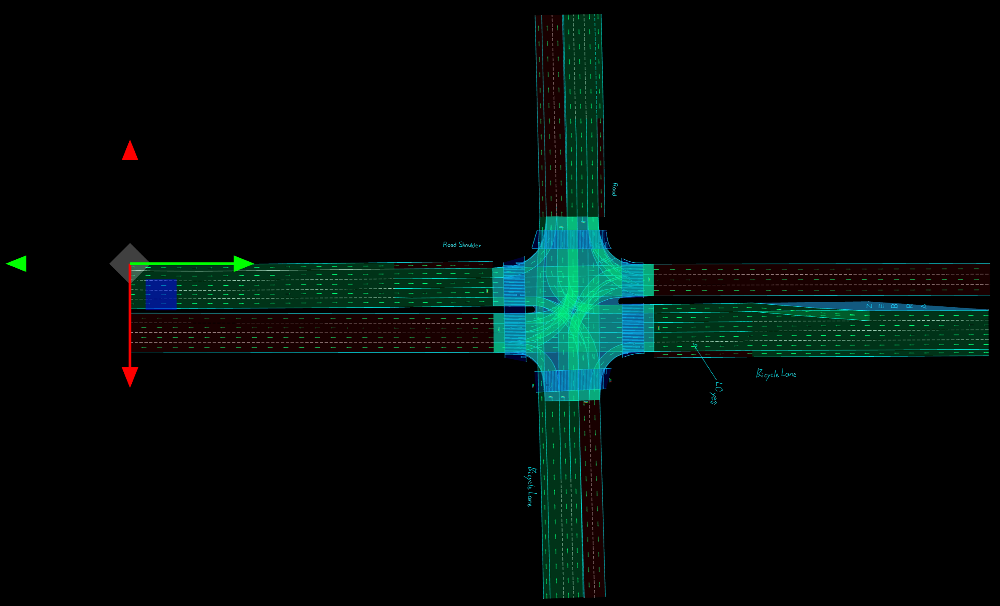

# autoware_lanelet2_utils

## Nomenclature

This package aims to strictly define the meaning of several words to clarify the documentation and API's scope. In the table below, `codespace` words are given specific meanings when used in the API and API description. _italic_ words are emphasized to indicate that it refers to social common sense which often comes with ambiguity. To help disambiguate the meaning, illustration is provided. "Lanelet" refers to the entity of a`lanelet::ConstLanelet` object in order to distinguish with the word "lane" used in social customs. `A` and `B` stands for some Lanelets objects.

| Word                              | Meaning                                                                                                                             | Illustration                                                                                                                                                                                                                                                                                                                                                    |
| --------------------------------- | ----------------------------------------------------------------------------------------------------------------------------------- | --------------------------------------------------------------------------------------------------------------------------------------------------------------------------------------------------------------------------------------------------------------------------------------------------------------------------------------------------------------- |
| `driving`                         | The vehicle position belongs to the designated Lanelet.                                                                             | In each map, green Lanelet are the `driving` lanes of the vehicle.<br><br>[Open]({{ drawio("/common/autoware_lanelet2_utility/media/nomenclature/driving.drawio.svg") }})                                                                                                                                    |
| `boundary`,<br>`entry`,<br>`exit` | The `boundary` of a Lanelet refers to the left or right Linestring.                                                                 | <br>[Open]({{ drawio("/common/autoware_lanelet2_utility/media/nomenclature/boundary_entry_exit.drawio.svg") }})                                                                                                                                                                      |
| `adjacent`                        | If A is `adjacent` to B, A and B share a common `boundary` with same direction either on the left or right side.                    | In each map, orange Lanelet is `adjacent` to green Lanelet.<br><br>[Open]({{ drawio("/common/autoware_lanelet2_utility/media/nomenclature/adjacent.drawio.svg") }})                                                                                                                                        |
| `same_direction`                  | Lanelet A and Lanelet B are `same_direction` if A and B are directly or indirectly `adjacent` to each other.                        | In each map, orange Lanelets are `same_direction` as green Lanelet.<br><br>[Open]({{ drawio("/common/autoware_lanelet2_utility/media/nomenclature/same_direction.drawio.svg") }})                                                                                                              |
| `bundle`                          | A `bundle` refers to a transitive closure set of Lanelets which are `same_direction` to each other.                                 | The enclosed sets of Lanelets are `bundle`s.<br><br>[Open]({{ drawio("/common/autoware_lanelet2_utility/media/nomenclature/bundle.drawio.svg") }})                                                                                                                                                             |
| `opposite`                        | If A is `opposite` to B, A and B share a common `boundary` with opposite direction.                                                 | In the first map, green Lanelet and orange Lanelet are `opposite` to each other.<br>In the second map, two red Lanelets are not `opposite` relation because they do not share a common LineString.<br><br>[Open]({{ drawio("/common/autoware_lanelet2_utility/media/nomenclature/opposite.drawio.svg") }}) |
| `opposite_direction`              | If A and B are `opposite_direction`, the `bundle` of A and B are directly `opposite` to each other.                                 | In the each map, green Lanelet and orange Lanelet are `opposite_direction` because their `bundle`s(enclosed in dotted line) are `opposite` relation.<br><br>[Open]({{ drawio("/common/autoware_lanelet2_utility/media/nomenclature/opposite_direction.drawio.svg")  }})                |
| `connected`                       | A is `connected` to(from) B if and only if the `exit`(`entry`) of A is identical to the `entry`(`exit`) of B.                       | A is connected to B, and B is connected from A.<br><br>[Open]({{ drawio("/common/autoware_lanelet2_utility/media/nomenclature/connected.drawio.svg") }})                                                                                                                                                 |
| `following`                       | The `following` Lanelets of A is the list of Lanelets to which A is `connected`.                                                    | In each map, orange Lanelets are the `following` of green Lanelet.<br><br>[Open]({{ drawio("/common/autoware_lanelet2_utility/media/nomenclature/following.drawio.svg") }})                                                                                                                              |
| `previous`                        | The `previous` Lanelets of A is the list of Lanelets from which A is `connected`.                                                   | In each map, orange Lanelets are the `previous` of green Lanelet. <br> <br>[Open]({{ drawio("/common/autoware_lanelet2_utility/media/nomenclature/previous.drawio.svg") }})                                                                                                                                |
| `conflicting`                     | A is `conflicting` with B if A and B are geometrically intersecting.                                                                |                                                                                                                                                                                                                                                                                                                                                                 |
| `merging`                         | A is said to be `merging` Lanelet of B if and only if A is `conflicting` with B and both A and B are connected to a common Lanelet. | In each map, one of the orange Lanelet is a `merging` Lanelet of the other orange Lanelet.<br><br>[Open]({{ drawio("/common/autoware_lanelet2_utility/media/nomenclature/merging.drawio.svg") }})                                                                                                            |
| `sibling`                         | The designated Lanelets are referred to as `sibling` if all of them are `connected` from a common Lanelet.                          | In each map, orange Lanelets are `sibling`s.<br><br>[Open]({{ drawio("/common/autoware_lanelet2_utility/media/nomenclature/sibling.drawio.svg") }})                                                                                                                                                          |
| `oncoming`                        | TBD                                                                                                                                 | TBD                                                                                                                                                                                                                                                                                                                                                             |
| `upcoming`                        | TBD                                                                                                                                 | TBD                                                                                                                                                                                                                                                                                                                                                             |
| `sequence`                        | `sequence` is a list of Lanelets whose each element is `connected from` or `adjacent to` the previous element.                      | <br>[Open]({{ drawio("/common/autoware_lanelet2_utility/media/nomenclature/sequence.drawio.svg") }})                                                                                                                                                                                                       |

## API description

| Header                                         | function                                                           | description                                                                                                                                                               | average computational complexity                                                   | illustration                                                                                                                                                                                                                                                                                                                                                                                                                                                                                                      |
| ---------------------------------------------- | ------------------------------------------------------------------ | ------------------------------------------------------------------------------------------------------------------------------------------------------------------------- | ---------------------------------------------------------------------------------- | ----------------------------------------------------------------------------------------------------------------------------------------------------------------------------------------------------------------------------------------------------------------------------------------------------------------------------------------------------------------------------------------------------------------------------------------------------------------------------------------------------------------- |
| `<autoware_lanelet2_utility/kind.hpp>`         | `is_road_lane`                                                     | This function returns `true` if the input Lanelet is `road` subtype.                                                                                                      | $O(1)$                                                                             |                                                                                                                                                                                                                                                                                                                                                                                                                                                                                                                   |
|                                                | `is_shoulder_lane`                                                 | This function returns `true` if the input Lanelet is `road_shoulder` subtype.                                                                                             | $O(1)$                                                                             |                                                                                                                                                                                                                                                                                                                                                                                                                                                                                                                   |
|                                                | `is_bicycle_lane`                                                  | This function returns `true` if the input Lanelet is `bicycle_lane` subtype.                                                                                              | $O(1)$                                                                             |                                                                                                                                                                                                                                                                                                                                                                                                                                                                                                                   |
| `<autoware_lanelet2_utility/topology.hpp>`     | `instantiate_routing_graph`                                        | This function creates a `RoutingGraph` object only from "road" lanes, which means "road_shoulder" and "bicycle_lane" Lanelets are inaccessible from left/right adjacency. |                                                                                    |                                                                                                                                                                                                                                                                                                                                                                                                                                                                                                                   |
|                                                | `left_lanelet`                                                     | This function ignores the permission of lane change. Also it ignores `shoulder` and `bicycle` Lanelet.                                                                    | $O(1)$                                                                             | In the first map, the green Lanelet is the `left_lanelet` of the orange Lanelet.<br>In the second and third map, the `left_lanelet` of the orange Lanelet is `null`.<br><br>[Open]({{ drawio("/common/autoware_lanelet2_utility/media/api/left_lanelet.drawio.svg") }})                                                                                                                                                                                       |
|                                                | `right_lanelet`                                                    | same as above `left_lanelet`                                                                                                                                              | $O(1)$                                                                             |                                                                                                                                                                                                                                                                                                                                                                                                                                                                                                                   |
|                                                | `left_opposite_lanelet`                                            | same as below `right_opposite_lanelet`                                                                                                                                    | $O(1)$<br>see [`findUsage`](./#complexity-of-findusage) for detail                 |                                                                                                                                                                                                                                                                                                                                                                                                                                                                                                                   |
|                                                | `right_opposite_lanelet`                                           | This functions returns the right `opposite` Lanelet of the input Lanelet if available, otherwise returns null.                                                            | $O(1)$<br>see [`findUsage`](./#complexity-of-findusage) for detail                 | In the first and second map, the green Lanelet is the `right_opposite_lanelet` of the orange Lanelet.<br>In the third map, the `right_opposite_lanelet` of the orange Lanelet is `null`.<br><br>[Open]({{ drawio("/common/autoware_lanelet2_utility/media/api/right_opposite_lanelet.drawio.svg") }})                                                                                                                                     |
|                                                | `leftmost_lanelet`                                                 | This function returns the Lanelet which is recursively left adjacent to the input Lanelet.                                                                                | $O(W)$ where $W$ is the size of the `bundle`.                                      | In the first and second map, the green Lanelet is the `leftmost_lanelet` of the orange Lanelet.<br>In the third map, the `leftmost_lanelet` of the orange Lanelet is `null`.<br><br>[Open]({{ drawio("/common/autoware_lanelet2_utility/media/api/leftmost_lanelet.drawio.svg") }})                                                                                                                                                                   |
|                                                | `rightmost_lanelet`                                                | This function returns the Lanelet which is recursively right adjacent to the input Lanelet.                                                                               | $O(W)$ where $W$ is the size of the `bundle`.                                      | In the first map, the green Lanelet is the `rightmost_lanelet` of the orange Lanelet.<br>In the second and third map, the `rightmost_lanelet` of the orange Lanelet is `null`.<br><br>[Open]({{ drawio("/common/autoware_lanelet2_utility/media/api/rightmost_lanelet.drawio.svg") }})                                                                                                                                                              |
|                                                | `left_lanelets`                                                    | The input Lanelet is not included in the output, and output is ordered from left to right.                                                                                | $O(W)$ where $W$ is the size of the `bundle`.                                      | In the first map, the green Lanelets are the `left_lanelets` of the orange Lanelet.<br>In the second and third map, `left_lanelets` of the orange Lanelet is empty.<br>If the flag `include_opposite = true`, the left opposite Lanelet and all of its `same_direction` Lanelets area also retrieved as illustrated in the fourth and fifth maps.<br><br>[Open]({{ drawio("/common/autoware_lanelet2_utility/media/api/left_lanelets.drawio.svg") }})       |
|                                                | `right_lanelets`                                                   | The input Lanelet is not included in the output, and output is ordered from right to left.                                                                                | $O(W)$ where $W$ is the size of the `bundle.`                                      | In the first map, the green Lanelets are the `right_lanelets` of the orange Lanelet.<br>In the second and third map, `right_lanelets` of the orange Lanelet is empty.<br>If the flag `include_opposite = true`, the right opposite Lanelet and all of its `same_direction` Lanelets area also retrieved as illustrated in the fourth and fifth maps.<br><br>[Open]({{ drawio("/common/autoware_lanelet2_utility/media/api/right_lanelets.drawio.svg") }}) |
|                                                | `following_lanelets`                                               | This function returns the `following` Lanelets of the input Lanelet. The order is not defined.                                                                            | $O(E)$ where $E$ is the number of Lanelets to which the input is connected to.     |                                                                                                                                                                                                                                                                                                                                                                                                                                                                                                                   |
|                                                | `previous_lanelets`                                                | This function returns the `previous` Lanelets of the input Lanelet. The order is not defined.                                                                             | $O(E)$ where $E$ is the number of Lanelets from which the input is connected from. |                                                                                                                                                                                                                                                                                                                                                                                                                                                                                                                   |
|                                                | `sibling_lanelets`                                                 | This function returns the `sibling` Lanelets of the input Lanelet excluding itself. The order is not defined.                                                             | $O(E)$ where $E$ is the number of sibling Lanelets                                 |                                                                                                                                                                                                                                                                                                                                                                                                                                                                                                                   |
|                                                | `from_ids`                                                         | This function returns Lanelet objects in the same order as the input IDs.                                                                                                 | $O(n)$                                                                             |                                                                                                                                                                                                                                                                                                                                                                                                                                                                                                                   |
| `<autoware_lanelet2_utility/intersection.hpp>` | `is_intersection_lanelet`                                          | This function returns `true` if and only if the input Lanelet has `turn_direction` attribute.                                                                             | $O(1)$                                                                             |                                                                                                                                                                                                                                                                                                                                                                                                                                                                                                                   |
|                                                | `is_straight_lanelet`,<br>`is_left_lanelet`,<br>`is_right_lanelet` | This function returns `true` if and only if the input Lanelet has `turn_direction` attribute and its value is `straight`/`left`/`right`.                                  | $O(1)$                                                                             |                                                                                                                                                                                                                                                                                                                                                                                                                                                                                                                   |

### complexity of `findUsage`

The readers should be noted that following description is implementation dependent.

- [LaneletMap.h](https://github.com/fzi-forschungszentrum-informatik/Lanelet2/blob/d9320cf66698004cd5e57988ac001e02e73e2e40/lanelet2_core/include/lanelet2_core/LaneletMap.h)
- [LaneletMap.cpp](https://github.com/fzi-forschungszentrum-informatik/Lanelet2/blob/d9320cf66698004cd5e57988ac001e02e73e2e40/lanelet2_core/src/LaneletMap.cpp)

Lanelet map primitives(like `Lanelet`, `Area`, `RegulatoryElement`) are stored in several `PrimitiveLayer<T>` objects according to their types as shown below.

```cpp title="lanelet2_core/LaneletMap.h#L375-L438"
class LaneletMap : public LaneletMapLayers {
 public:
  using LaneletMapLayers::LaneletMapLayers;
  <...>
};
```

```cpp title="lanelet2_core/LaneletMap.h#L313-L359"
class LaneletMapLayers {
  <...>
  LaneletLayer laneletLayer;                      //!< access to the lanelets within this map
  AreaLayer areaLayer;                            //!< access to areas
  RegulatoryElementLayer regulatoryElementLayer;  //!< access to regElems
  PolygonLayer polygonLayer;                      //!< access to the polygons
  LineStringLayer lineStringLayer;                //!< access to the lineStrings
  PointLayer pointLayer;                          //!< access to the points
};
```

```cpp title="lanelet2_core/LaneletMap.h#L285-L303"
class LaneletLayer : public PrimitiveLayer<Lanelet> {
 public:
  using PrimitiveLayer::findUsages;
  LaneletLayer() = default;
  ~LaneletLayer() = default;
  LaneletLayer(const LaneletLayer&) = delete;
  LaneletLayer operator=(LaneletLayer&) = delete;
  Lanelets findUsages(const RegulatoryElementConstPtr& regElem);
  ConstLanelets findUsages(const RegulatoryElementConstPtr& regElem) const;
  <...>
};
```

Each `PrimitiveLayer` owns a field named `tree_` that contains a lookup table named `usage` of type `UsageLookup`,

```cpp title="lanelet2_core/LaneletMap.h#L38-L253"
template <typename T>
class PrimitiveLayer {
 public:
 <...>
  /**
   * @brief finds usages of an owned type within this layer
   *
   * This is the non-const version to find usages of a primitive in a layer.
   */
  std::vector<PrimitiveT> findUsages(const traits::ConstPrimitiveType<traits::OwnedT<PrimitiveT>>& primitive);
  <...>
  struct Tree;
  // NOLINTNEXTLINE
  std::unique_ptr<Tree> tree_;  //!< Hides boost trees from you/the compiler
```

```cpp title="lanelet2_core/src/LaneletMap.cpp#L277-L308"
template <typename T>
struct PrimitiveLayer<T>::Tree {
  using TreeNode = std::pair<BoundingBox2d, T>;
  using RTree = bgi::rtree<TreeNode, bgi::quadratic<16>>;
  static TreeNode treeNode(const T& elem) { return {geometry::boundingBox2d(to2D(elem)), elem}; }
  <...>
  RTree rTree;
  UsageLookup<T> usage;
};
```

and `UsageLookup` contains reference relation between different types as `std::unordered_multimap`.

```cpp title="lanelet2_core/src/LaneletMap.cpp#L259-L270"
template <>
struct UsageLookup<Lanelet> {
  void add(Lanelet ll) {
    ownedLookup.insert(std::make_pair(ll.leftBound(), ll));
    ownedLookup.insert(std::make_pair(ll.rightBound(), ll));
    for (const auto& elem : ll.regulatoryElements()) {
      regElemLookup.insert(std::make_pair(elem, ll));
    }
  }
  std::unordered_multimap<ConstLineString3d, Lanelet> ownedLookup;
  std::unordered_multimap<RegulatoryElementConstPtr, Lanelet> regElemLookup;
};
```

Thus the complexity of `findUsage` function is equal to that of `std::unordered_multimap::equal_range` which is $O(1)$.

```cpp title="lanelet2_core/src/LaneletMap.cpp#L419-L424"
template <typename T>
std::vector<typename PrimitiveLayer<T>::ConstPrimitiveT> PrimitiveLayer<T>::findUsages(
    const traits::ConstPrimitiveType<traits::OwnedT<PrimitiveLayer<T>::PrimitiveT>>& primitive) const {
  return forEachMatchInMultiMap<traits::ConstPrimitiveType<typename PrimitiveLayer<T>::PrimitiveT>>(
      tree_->usage.ownedLookup, primitive, [](const auto& elem) { return traits::toConst(elem.second); });
}
```

```cpp title="lanelet2_core/src/LaneletMap.cpp#L165-L169"
template <typename T, typename MapT, typename KeyT, typename Func>
std::vector<T> forEachMatchInMultiMap(const MapT& map, const KeyT& key, Func&& f) {
  auto range = map.equal_range(key);
  return utils::transform(range.first, range.second, f);
}
```

## Test maps

All of the maps are in `MGRS` coordinate. In each map, an anchor point is set to an origin point $(100.0, 100.0)$ for simplicity.

| Map name                    | Origin point id | Image                                               |
| --------------------------- | --------------- | --------------------------------------------------- |
| `road_shoulder/highway.osm` | `1`             |   |
| `road_shoulder/pudo.osm`    | `140`           |         |
| `intersection/crossing.osm` | `1791`          |  |

### How to craft test map

On the VMB, create the map in MGRS system and save the file as `<input_map.osm>`. Next, select the point to set as origin, get its `<ID>` and run

```bash
ros2 run autoware_lanelet2_utility lanelet_anonymizer.py <input_map.osm> <output_map.osm> <ID>
```

Then the coordinate of the specified point is (100, 100) on the loaded map(NOTE: not exactly (0, 0) because MGRS does not any point to have negative coordinate value).

By applying `lanelet_id_aligner.py`, the primitive ids are aligned to start from 1 and increase one-by-one.

```bash
ros2 run autoware_lanelet2_utility lanelet_id_aligner.py <input_map.osm>
```
